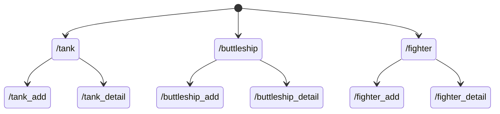

## 最終レポート用アイディアまとめ
###　システム化する対象候補(何にするかは決めてない)
戦車・戦艦・戦闘機・ビル・
### ページ遷移(前のページに戻れるようになっている)

```mermaid
stateDiagram-v2

[*] --> /tank
/tank --> /tank_add
/tank --> /tank_detail

[*] --> /buttleship
/buttleship --> /buttleship_add
/buttleship --> /buttleship_detail

[*] --> /fighter
/fighter --> /fighter_add
/fighter --> /fighter_detail
```

### スキーム(表内に表示するパラメータ)
#### 戦車(/tank版)
1. 名称
2. 開発国
3. 配備開始年