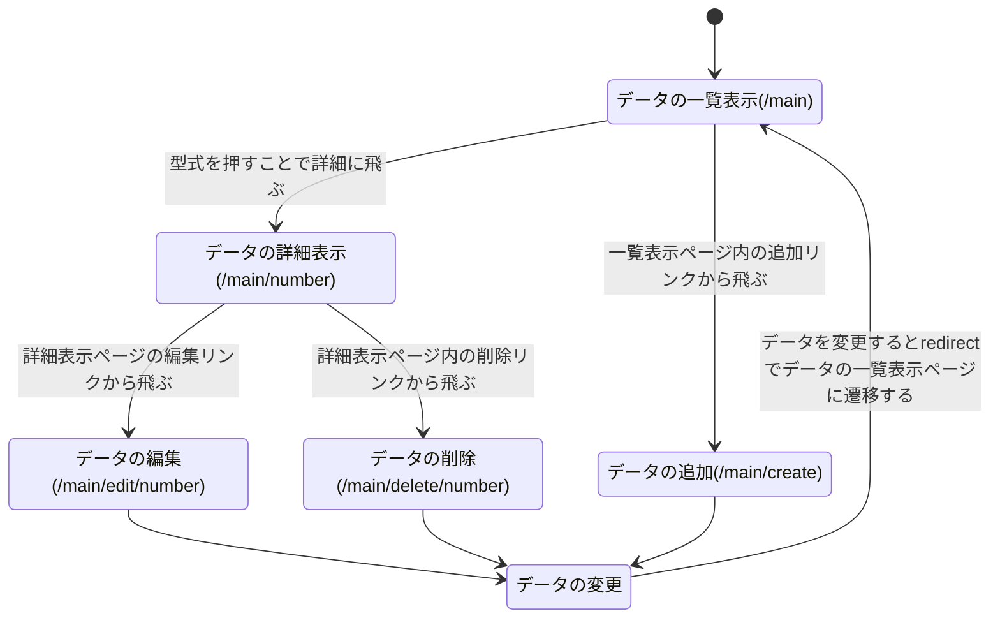

## 開発者用仕様書(仮)
仮なので実際にシステム化する際は変更点が存在する可能性大
### 戦闘機一覧表示システム
#### データとして入れるもの
データの項目 | id |  型式 | 愛称 | 生産国名 | 運用開始年 | 改良型　輸出型 | 小ネタ
-|-|-|-|-|-|-|-
具体例 | 1 | f-15 | イーグル | アメリカ | 1976 | f-15J　など|生産されたf-15の中で日本が唯一航空機による被撃墜を記録した(f-15Jによる訓練中の誤射によるもの)

#### データの変数名
定義した変数名はデータを設定する際に使用し，データを呼び出したり追加・削除する際に使用する
```text
データそのもの...combat
id...id
型式...model
愛称...nickname
生産国名...country
運用開始年...year
改良型輸出型...sister
小ネタ...small
```

#### ページの機能として実装すること
機能としてはデータの一覧表示・データ毎の詳細な表示・データの追加・すでにあるデータの編集・データの削除を実装する

#### ページの遷移図
どのような機能のページ化は文で記述し，表示させる際のリソース名は括弧内に記述する


#### ページごとの使用するメゾット
postメゾットを使用する物

データの一覧表示を行う **/combat** や編集を行う際に編集ページの内容をデータの詳細表示の内容と合わせる **/combat/update/number** 

getメゾットを使用する物
データの追加を行う **/combat/add** ，データの詳細表示を行う **/combat/number** ，データの編集画面を表示する **/combat/edit/number** ，データの削除を行う **/combat/delete/number** ，データの削除確認画面を表示する **/combat/delete/check**

#### ページの構造
1. 全てのページにおいて，中央に表示するように位置の調整を行う
2. 各ページのタイトルを60px程度で表示し，データの各項目は20px程度で表示する
3. ページの構造をテンプレートファイルやhtmlでいちいち設定するのは時間がかかり，変更しにくいためCSSファイルを作成して統一した構造にする
4. 一覧表示ページの追加・削除リンクや詳細表示ページの編集リンクはデータの表示部分から20px程度離して20px程度の大きさで中央に表示する
5. データの追加や編集を行うフォームも中央に表示するよう位置調整を行う

### 戦闘艦一覧表示システム
戦闘機の一覧表示システムの仕様を粗方定義した後策定するため，今回は使用を定義しない
### ビル一覧表示システム
戦闘機の一覧表示システムの仕様を粗方定義した後策定するため，今回は使用を定義しない